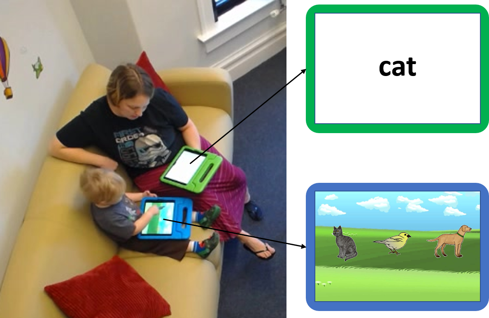

```{r load_packages, include = FALSE}
library(png)
library(grid)
library(egg)
library(xtable)
library(knitr)
library(papaja)
library(ggthemes)
library(lme4)
library(lmerTest)
library(directlabels)
library(ggrepel)
library(here)
library(scales)
library(tidyboot)
library(broom)
library(broom.mixed)
library(kableExtra)
library(english)
library(ggthemes)
library(tidyverse)

theme_set(theme_few(base_size = 10) + theme(legend.position = "none"))

knitr::opts_chunk$set(fig.pos = 'tb', echo = FALSE, cache = TRUE, 
                      warning = FALSE, message = FALSE, 
                      sanitize = TRUE, fig.path='figs/', fig.width = 3,
                      fig.height = 3)
set.seed(42)
options(digits=3)
```

In just a few short years, children develop a striking mastery of their native language. Undoubtedly, a large share of the credit for this feat is due to the powerful learning mechanisms that children bring to bear on their input [@kuhl2004; @saffran1996]. However, a share of the credit may also be due to the structure of linguistic input itself. In line with this proposal, individual differences in the quantity and quality of the language children hear are associated with individual differences in language learning [@hart1995; @huttenlocher2010; @rowe2012]. Further, this association is driven by speech children hear in interactions with their caregivers; differences in overheard speech do not predict differences in language learning, even in communities where child-directed speech is relatively rare [@weisleder2013; @romeo2018; @shneidman2012].

Child-directed speech differs from adult-directed speech along many dimensions, most of which are characterized by simplification [@nelson1989; @snow1972]. But, the amount of simplification changes over development--parents direct longer and more complex utterances to older children [@huttenlocher2010]. Thus, child-directed speech may facilitate learning not because it is uniformly simpler, but because it is adaptive, being tuned to the right level of complexity for children's ongoing language development [@snow1972; @vygotsky1978]. How precisely tuned is child-directed speech?

One possibility is that tuning is *coarse*: Caregivers could tune the complexity of their speech generally, using a holistic sense of their children developing linguistic abilities. This possibility is consistent with a body of evidence showing that parents tune their utterance lengths, articulation of vowels, and diversity of clauses to children age [@moerk1976; @bernstein-ratner1984; @huttenlocher2010]. However, linguistic tuning would be an even more powerful scaffold for learning if parents *fine-tuned* their speech, taking into account not only children's global linguistic development, but their specific knowledge of smaller units of language, such as lexical items [@bruner1983]. To date, the only evidence for fine-tuning comes from two observational studies, one showing that parents are more likely to provide their child with labels for novel as compared to familiar toys [@masur1997], and the second showing that the lengths of three caregivers' utterances containing a particular word are shortest just before their child first produces that word [@roy2009].

Here, we present the first *experimental* evidence for fine-tuning. We asked children and their parents to play a reference game in which the parent's goal was to guide their child to select a target animal from a set of three. Parents tuned the amount of information in their utterances not just to the average difficulty of each animal word, but to their prior estimates of their individual child's knowledge of that animal. Further, parents sensitively adapted over the course of the reference game, providing more information on subsequent trials when they discovered that their child did not know an animal. Together, these results show that parents leverage their considerable knowledge of their children's language development to fine-tune the information they provide.

# Method

```{r load_data}
demos <- read_csv(here("data/demographics.csv"))

subj_vocab <- read_csv(here("data/subj_vocab.csv"))

test_data <- read_csv(here("data/test_data.csv"))

target_data <- read_csv(here("data/transcripts.csv")) %>%
  left_join(subj_vocab, by = c("subj", "trial_target" = "word")) %>%
  filter(phase == "pre", !is.na(understands)) %>%
  complete(nesting(subj, target, understands, appearance),
           fill = list(length = 0)) %>%
  mutate(understands = factor(understands, levels = c(T,F), 
                              labels = c("Knows", "Doesn't Know")))

possible_vocab <- subj_vocab %>%
  distinct(possible_vocab) %>%
  pull()

#tidy_test_data <- read_feather(here("data/qual_model.feather"))

#qual_data <- read_feather(here("data/qual_data.feather"))
```

## Participants

```{r youngest_and_oldest}
youngest_child <- demos %>%
  filter(age_years == min(age_years))

oldest_child <- demos %>%
  filter(age_years == max(age_years))

mean_age <- demos %>%
  summarise(age_days = mean(age_years * 365)) %>%
  mutate(age_months = floor(age_days / 30.5),
         age_extra_days = floor(age_days - (age_months * 30.5)))

youngest_chid_months <- youngest_child %>% 
  pull(age_months)
youngest_child_days <- youngest_child %>% 
  pull(age_extra_days)


oldest_child_months <- oldest_child %>% 
  pull(age_months)
oldest_child_days <- oldest_child %>% 
  pull(age_extra_days)

mean_months <- mean_age %>% pull(age_months)
mean_days <- mean_age %>% pull(age_extra_days)

n_girls <- demos %>% 
  summarise(female = sum(gender == "female")) %>% 
  pull

white_pct <- demos %>% 
  summarise(race = mean(race == "White")) %>% 
  pull(race) %>% 
  percent()

black_pct <- demos %>% 
  summarise(race = mean(race == "Black or African American")) %>% 
  pull(race) %>% 
  percent()

hispanic_pct <- demos %>% 
  summarise(hispanic = mean(hispanic == "yes", na.rm = TRUE)) %>% 
  pull(hispanic) %>% 
  percent()

degree_pct <- demos %>% 
  summarise(mom_ed = mean(mom_ed %in% c("4-Year College", 
                                        "Graduate degree"))) %>% 
  pull(mom_ed) %>% 
  percent()
```

Toddlers (aged 2-2.5 years) and their parents were recruited from a database of families in the local community or approached on the floor of a local science museum in order to achieve a planned sample of 40 parent-child dyads. A total of 48 parent-child pairs were recruited, but data from 7 pairs were dropped from analysis because of failure to complete the experiment as designed. The final sample consisted of `r nrow(demos)` children aged `r youngest_chid_months` mo.; `r youngest_child_days` days to `r oldest_child_months` mo.; `r oldest_child_days` days ($M =$ `r mean_months` mo.; `r mean_days` days), `r n_girls` of whom were girls. 

In our recruitment, we made an effort to sample children from a variety of racial and socio-economic groups. Our final sample was roughly representative of the racial composition of the Chicago Area and the US more broadly (`r white_pct` White, `r black_pct` Black, `r hispanic_pct` Hispanic). However, our sample was significantly more educated than the broader community (`r degree_pct` of mothers had a College or Graduate Degree).

## Stimuli

```{r aoa_data}
animals <- read_csv(here("corpus_data/predicted_aoas.csv"))%>%
  select(word, aoa) %>%
  left_join(select(subj_vocab, word, type) %>% distinct(), by = "word") %>%
  mutate(type = case_when(
    word == "rooster" ~ "late",
    word == "pig" ~ "early",
    T ~ type)) %>%
  filter(!is.na(type))

min_aoa <- animals %>% 
  pull(aoa) %>% 
  min() %>% 
  round()

max_aoa <- animals %>% 
  pull(aoa) %>% 
  max() %>% 
  round()

early_min_aoa <- animals %>% 
  filter(type == "early") %>% 
  pull(aoa) %>% 
  min() %>% 
  round()

early_max_aoa <- animals %>% 
  filter(type == "early") %>% 
  pull(aoa) %>% 
  max() %>% 
  round()

late_min_aoa <- animals %>% 
  filter(type == "late") %>% 
  pull(aoa) %>% 
  min() %>% 
  round()

late_max_aoa <- animals %>% 
  filter(type == "late") %>% 
  pull(aoa) %>% 
  max() %>% 
  round()

total_vocab <- subj_vocab %>% 
  pull(possible_vocab) %>% 
  mean()
```

Eighteen animal images were selected from the @rossion2004 image set, a colorized version of the @snodgrass1980 object set. Animals were selected based on estimates of their age of acquisition (AoA) for American English learners. To obtain these estimates, we used two sources of information: parent-report estimates of children's age of acquisition from Wordbank [@frank2017], and retrospective self-report estimates of AoA from adults [@kuperman2012, see Supporting Information for details]. The AoA of the selected animals ranged from `r min_aoa` to `r max_aoa` months. Half of the animals were chosen to have an early age of acquisition (`r early_min_aoa`-`r early_max_aoa` months), and the other half were chosen to have a late age of acquisition (`r late_min_aoa`-`r late_max_aoa` months). Each trial featured three animals, all from either the early AoA or late AoA category. This separation was designed to lower the likelihood that children could use knowledge of early AoA animals to infer the correct target on late AoA trials.

A modified version of the MacArthur-Bates Communicative Development Inventory Short Form [CDI; @fenson2007], a parent-reported measure of children's vocabulary, was administered before the testing session via an online survey. The selected animal words were added to the standrd words, producing a the `r total_vocab` word survey. Two of the animal words--one in the early AOA (pig) and one in the late AOA category (rooster)--were accidentally omitted, so trials for those words were not included in analyses as we could not obtain individual-level estimates of children's knowledge.

## Design and Procedure

```{r ipads, fig.env = "figure", fig.pos = "tb", fig.align='center', fig.width=6, fig.height=4, set.cap.width=T, num.cols.cap=1, fig.cap = "A parent-child dyad playing the reference game. On each trial, the parent's goal was to use language to communicate to their child which animal to choose."}

```

Each parent-child pair played an interactive reference game using two iPads (Figure \ref{fig:ipads}). Children began with two warm-up trials in which they tapped on circles that appeared on the iPads. Following these warm-up trials, children and their parents moved on to practice and then experimental trials. On each trial, three images of animals were displayed side by side on the child's screen, and a single word appeared on the parent's screen. Parents were instructed to communicate as they normally would with their child, and to encourage their child to choose the object corresponding to the word on their screen. The child was instructed to listen to their parent for cues. Once the child tapped an animal, the trial ended, and a new trial began. There were a total of 36 experimental trials, such that each animal appeared as the target twice. Trials were randomized for each participant, with the constraint that the same animal could not be the target twice in a row. Practice trials followed the same format as experimental trials, with the exception that images of fruit and vegetables were shown. All sessions were videotaped for transcription and coding.

## Data analysis

Our primary quantity of interest was the amount of information that parents provided in each of their utterances. To approximate this, we measured the length of parents' referring expressions--the number of words they produced on each trial before their child selected an animal. Length is an imperfect proxy for information, but it is easy to quantify and theory-agnostic. Because utterance length is highly right-skewed (i.e. most utterances are short), we log-transformed length in all analyses. However, to facilitate interpretability, we show raw utterances length in our figures. Subsequently, utterances were manually coded for the following: (1) Use of an animal's canonical label (e.g., "leopard"), (2) Use of a descriptor (e.g., "spotted"), (3) Use of a comparison (e.g., "like a cat"), (4) Use of a subordinate category label (e.g., "Limelight Larry" for peacock), and (5) Use of a superordinate level category label (e.g., "bird" for peacock). Parent utterances irrelevant to the game (e.g. asking the child to sit down) were not analyzed. Children's utterances were coded when audible, but were not analyzed. 

Our second source of data was the vocabulary questionnaire that parents filled out prior to participation. Parents indicated whether their child produced each of the `r possible_vocab` words on the survey. In addition to analyzing parents' judgments for the animals in the task, we also computed the total number of words judged to be known for each child as a proxy for total vocabulary.

All of our analyses were done using mixed-effects models. In all cases we began with maximal random effects structures and pruned random effects until the models converged. We removed interaction terms before removing main effects, and opted to keep the most-theory relevant random effects when only a subset of main effects could be kept. For clarity, we present only the key findings and statistics here, but full model details can be found in the Supporting Information.

# Results

We begin by confirming that our a priori divisions of animals into early and late age of acquisition in the study design were reflected in parents' survey judgments, and that children were able to follow parents' references to select the correct target animal on each trial. After this, we show that parents fine-tune their referring expressions, producing more information in their references to animals that they think their individual children do not know. Further, parents update their tuning over the course of the experiment, producing more information on subsequent references to animals they thought they children knew but observed evidence to the contrary (i.e. children made an incorrect selection). 

```{r word_difficulty}
group_difficulty <- subj_vocab %>%
  group_by(type, word) %>%
  summarise(understands = mean(understands)) %>%
  tidyboot_mean(understands)

mean_word_difficulty <- subj_vocab %>%
  distinct(word, type, avg_known, ci_upper, ci_lower) %>%
  arrange(avg_known)

difficulty_lmer <- subj_vocab %>%
  mutate(type = factor(type, levels = c("early", "late"))) %>%
  glmer(understands ~ type + (type|subj) + (1|word),
        family = "binomial", data = .) %>%
  tidy() %>%
  filter(effect == "fixed") %>%
  select(-effect, -group)


difficulty_type_estimate <- difficulty_lmer %>% 
  filter(term == "typelate") %>% 
  pull(estimate)

difficulty_type_statistic <- difficulty_lmer %>%
  filter(term == "typelate") %>% 
  pull(statistic)

difficulty_type_p <- difficulty_lmer %>% 
  filter(term == "typelate") %>% 
  pull(p.value) %>% 
  printp()
```

## Target animal difficulty

```{r descriptives}
early_understood <- group_difficulty %>% 
  filter(type == "early") %>% 
  mutate(empirical_stat = empirical_stat * 100) %>% 
  pull(empirical_stat) %>% 
  round(0)

late_understood <- group_difficulty %>%
  filter(type == "late") %>% 
  mutate(empirical_stat = empirical_stat * 100) %>% 
  pull(empirical_stat) %>% 
  round(0)
```

We first confirm that the animals early age of acquisition (AoA) animals were more likely to be marked "known" by the parents of children in our studies. As predicted, parents judged that their children knew `r early_understood`% of the animals in the early AoA category, and `r late_understood`% of the animals in the late AoA category, which were reliably different from each-other ($\beta =$ `r difficulty_type_estimate`, $p$ `r difficulty_type_p`). Parents' judgments for each target word are shown in the Supporting Information.

## Selection accuracy

```{r test-data}
test_prediction_data <- target_data %>%
  filter(phase == "pre", !is.na(understands), !is.na(target)) %>%
  group_by(understands, subj, trial, target, appearance) %>%
  summarise(length = sum(length)) %>%
  mutate(log_length = log(length)) %>%
  left_join(select(test_data, subj, trial_num, target, correct), 
            by = c("subj", "trial" = "trial_num", "target")) %>%
  left_join(select(subj_vocab, subj, vocab) %>% distinct(), by = c("subj"))

overall_correct <- test_prediction_data %>%
  group_by(subj, target, appearance) %>%
  summarise(correct = mean(correct)) %>%
  summarise(correct = mean(correct)) %>%
  summarise(correct = mean(correct)) %>%
  summarise(correct = mean(correct)) %>%
  mutate(correct = correct * 100) %>%
  pull()

type_correct <- test_prediction_data %>%
  group_by(understands, subj, target, appearance) %>%
  summarise(correct = mean(correct)) %>%
  summarise(correct = mean(correct)) %>%
  summarise(correct = mean(correct)) %>%
  summarise(correct = mean(correct)) %>%
  mutate(correct = correct * 100)

known_correct <- type_correct %>% 
  filter(understands == "Knows") %>%
  pull()

unknown_correct <- type_correct %>% 
  filter(understands == "Doesn't Know") %>%
  pull()


overall_acc_model <- glmer(correct ~ 1 + offset(base) + (1 | subj) + (1 | target),
      data = test_prediction_data %>% mutate(base = log(1/3)), 
      family = "binomial") %>%
  tidy() %>%
  filter(effect == "fixed") %>%
  select(-effect, -group, -std.error) %>%
  mutate(p.value = printp(p.value))

overall_acc_estimate <- overall_acc_model %>%
  pull(estimate)

overall_acc_statistic <- overall_acc_model %>%
  pull(statistic)

overall_acc_p <- overall_acc_model %>%
  pull(p.value)

type_acc_model <- test_prediction_data %>% 
  mutate(base = log(1/3)) %>%
  group_by(understands)  %>%
  nest() %>%
  mutate(model = map(data, ~glmer(correct ~ 1 + offset(base) + (1 | subj) +
                                    (1 | target),
                                  data =. , family = "binomial") %>% 
                       tidy())) %>%
  select(-data) %>%
  unnest(cols = c(model)) %>%
  filter(effect == "fixed") %>%
  select(-effect, -group, -std.error) %>%
  mutate(p.value = printp(p.value))


known_acc_estimate <- type_acc_model %>%
  filter(understands == "Knows") %>%
  pull(estimate)

known_acc_statistic <- type_acc_model %>%
  filter(understands == "Knows") %>%
  pull(statistic)

known_acc_p <- type_acc_model %>%
  filter(understands == "Knows") %>%
  pull(p.value)

unknown_acc_estimate <- type_acc_model %>%
  filter(understands == "Doesn't Know") %>%
  pull(estimate)

unknown_acc_statistic <- type_acc_model %>%
  filter(understands == "Doesn't Know") %>%
  pull(statistic)

unknown_acc_p <- type_acc_model %>%
  filter(understands == "Doesn't Know") %>%
  pull(p.value)

test_lmer <- test_prediction_data %>%
  glmer(correct ~ log_length * understands + vocab + understands +
        (1 | subj) + (1 | target), 
      family = "binomial",
      data = .) %>%
  tidy() %>%
  filter(effect == "fixed") %>%
  select(-effect, -group, -std.error) %>%
  mutate(p.value = printp(p.value))


test_length_estimate <- test_lmer %>%
  filter(term == "log_length") %>%
  pull(estimate)

test_length_statistic <- test_lmer %>%
  filter(term == "log_length") %>%
  pull(statistic)

test_length_p <- test_lmer %>%
  filter(term == "log_length") %>%
  pull(p.value)

test_unknown_estimate <- test_lmer %>%
  filter(term == "understandsDoesn't Know") %>%
  pull(estimate)

test_unknown_statistic <- test_lmer %>%
  filter(term == "understandsDoesn't Know") %>%
  pull(statistic)

test_unknown_p <- test_lmer %>%
  filter(term == "understandsDoesn't Know") %>%
  pull(p.value)

test_vocab_estimate <- test_lmer %>%
  filter(term == "vocab") %>%
  pull(estimate)

test_vocab_statistic <- test_lmer %>%
  filter(term == "vocab") %>%
  pull(statistic)

test_vocab_p <- test_lmer %>%
  filter(term == "vocab") %>%
  pull(p.value)

test_length_unknown_estimate <- test_lmer %>%
  filter(term == "log_length:understandsDoesn't Know") %>%
  pull(estimate)

test_length_unknown_statistic <- test_lmer %>%
  filter(term == "log_length:understandsDoesn't Know") %>%
  pull(statistic)

test_length_unknown_p <- test_lmer %>%
  filter(term == "log_length:understandsDoesn't Know") %>%
  pull(p.value)
```

On the whole, parents communicated effectively with their children, such that children selected the correct target on `r overall_correct`\% of trials, reliably greater than would be expected by chance (33\%, $\beta =$  `r overall_acc_estimate`, $p$ `r overall_acc_p`). Children were above chance both for animals that parents thought they knew ($M =$ `r known_correct`\%, $\beta =$ `r known_acc_estimate`, $p$ `r known_acc_p`), and for animals that parents thought their children did not know ($M =$ `r unknown_correct`\%, $\beta =$  `r unknown_acc_estimate`, $p$ `r unknown_acc_p`). Thus, parents successfully communicated the target referent to children, even when parents thought their children did not know the name for the animal at the start of the game. 

Was this accuracy driven by children's knowledge or parents' referential expressions? To answer this question, we fit a mixed-effects logistic regression predicting children's accuracy on each trial from children's total estimated vocabulary, knowledge of the target animal, and the (log) length of parents' expressions. We found that children with bigger vocabularies were more accurate in general ($\beta =$  `r test_vocab_estimate`, $p =$ `r test_vocab_p`), and that children were less accurate for animals whose names they did not know ($\beta =$  `r test_unknown_estimate`, $p$ `r test_unknown_p`). Longer referential expressions were associated with lower accuracy for known animals ($\beta =$ `r test_length_estimate`, $p =$ `r test_length_p`), but greater accuracy for unknown animals ($\beta =$ `r test_length_unknown_estimate`, $p =$ `r test_length_unknown_p`).

Thus, longer referential expressions were associated with more successful communication for animals that children did not know, but were unhelpful for animals that they did know. We next ask whether parents tuned the lengths of their utterances appropriately, producing longer expressions for unknown animals.

```{r continuous-plot-data}
continuous_plot_data <- target_data %>%
  group_by(trial_target, subj, appearance) %>%
  summarise(length = sum(length)) %>%
  summarise(length = mean(length)) %>%
  tidyboot_mean(length) %>%
  rename(length = empirical_stat,
         length_upper = ci_upper,
         length_lower = ci_lower) %>%
  left_join(mean_word_difficulty, by = c("trial_target" = "word")) %>%
  rename(avg_known_lower = ci_lower, avg_known_upper = ci_upper) %>%
  mutate(plotting_target = if_else(trial_target %in% c("squirrel", "cat",
                                                       "swan"),
                                   trial_target, as.character(NA)))
```

```{r difficulty-fig-setup, cache = FALSE}
p1_annotations <- tibble(avg_known = c(.25, .85),
                         length = c(12.5, 11),
                         avg_known_lower = as.numeric(c(NA, NA)),
                         avg_known_upper = as.numeric(c(NA, NA)),
                         length_lower = as.numeric(c(NA, NA)),
                         length_upper = as.numeric(c(NA, NA)),
                         plotting_target = c("late AoA", "early AoA"),
                         type = c("late", "early"))


p1 <- ggplot(continuous_plot_data, aes(x = avg_known, y = length, 
                                 xmin = avg_known_lower,
                          xmax = avg_known_upper, ymin = length_lower,
                          ymax = length_upper,
                          label = plotting_target,
                          color = type)) + 
  geom_smooth(method = "lm", formula = "y ~ x", se = F, color = "black") +
  geom_pointrange()+ 
  geom_errorbarh() + 
  geom_label_repel(size = 2.5) +
  theme(legend.position = "none") +
  labs(x = "Proportion of children reported knowing target word", 
       y = "Referring expression length") +
  geom_text(data = p1_annotations) +
  scale_color_ptol() 
```


```{r individual-plot-data}
individual_data <- target_data %>%
  filter(appearance == "first") %>%
  group_by(understands, subj, trial_target) %>%
  summarise(length = sum(length)) %>%
  summarise(length = mean(length)) %>%
  mutate(type = "First appearance")

group_data <- individual_data %>%
  tidyboot_mean(length) %>%
  rename(length = empirical_stat,
         length_upper = ci_upper,
         length_lower = ci_lower) %>%
  mutate(subj = "mean") %>%
  mutate(type = "First appearance")
```

```{r lag-data}
setup_lag_data <- test_prediction_data %>%
  arrange(subj, understands, target,appearance, correct) %>%
  group_by(subj, understands, target) %>%
  mutate(correct = factor(correct, levels = c(TRUE, FALSE), 
                          labels = c("correct", "incorrect"))) %>%
  mutate(lag_correct = lag(correct)) 


indiv_lag_data <- setup_lag_data %>%
    filter(appearance == "second", !is.na(lag_correct)) %>%
  group_by(understands, lag_correct, subj, target) %>%
  rename(type = lag_correct) %>%
  group_by(understands, type, subj) %>%
  summarise(length = mean(length))

group_lag_data <- indiv_lag_data %>%
  tidyboot_mean(length) %>%
  rename(length = empirical_stat,
         length_upper = ci_upper,
         length_lower = ci_lower) %>%
  mutate(subj = "mean")
```


```{r known-fig, fig.width = 4.5, fig.height = 5, fig.env = "figure", fig.cap = "(A) Parents produced longer referring expressions to communicate about animals that children were generally less likely to know. (B) Parents produced longer referring expressions for words that they thought their child did not know (left panel). When children selected correctly in response to these expressions, parents continued to produce longer expressions for animals they thought their children did not know. However, if parents thought their child knew an animal, and they chose incorrectly, parents lengthened produced longer expressions on its second appearance (right 2 panels). Gray points and lines represent individual participants, colored points and  lines show group averaged proportions; error bars show 95\\% confidence intervals computed by non-parametric bootstrap.", cache = FALSE}


individual_plot_data <- bind_rows(individual_data, indiv_lag_data) %>%
  mutate(type = factor(type, 
                       levels = c("First appearance", "correct", "incorrect"),
                       labels = c("First appearance", "Following correct", 
                                  "Following incorrect")))

group_plot_data <- bind_rows(group_data, group_lag_data) %>%
  mutate(type = factor(type, 
                       levels = c("First appearance", "correct", "incorrect"),
                       labels = c("First appearance", "Following correct", 
                                  "Following incorrect")))

p2 <- ggplot(individual_plot_data, aes(x = understands, y = length, 
                                       group = subj)) + 
  geom_point(alpha = .5, position=position_dodge(0.06), color = "light gray") +
  geom_line(alpha = .5, color = "light gray", position=position_dodge(0.06)) +
  scale_x_discrete(labels= c("Known\nanimal", "Unknown\nanimal"), 
                   expand = c(.1, .1)) + 
  labs(x ="", y = "Referring expression length") +
  facet_wrap(~ type) +
  geom_pointrange(aes(ymin = length_lower, ymax = length_upper), 
                  data = group_plot_data) + 
  geom_line(data = group_plot_data) +
  scale_y_continuous(limits = c(2, 15))

ggarrange(p1, p2, nrow = 2, heights = c(1, 1), labels = c("a", "b"))
```


## Tuning

```{r trial-known-data}
trial_known_data <- target_data %>%
  mutate(phase = factor(phase, levels = c("pre", "post")),
         understands = factor(understands, labels = c("unknown animal", 
                                                      "known animal"))) %>%
  group_by(phase, avg_known, understands, subj, appearance, trial, trial_target) %>%
  summarise(length = sum(length)) %>%
  left_join(select(subj_vocab, subj, vocab), by = "subj") %>%
  mutate(log_length = log(length))

mean_known_data <- trial_known_data %>%
  group_by(phase, understands, subj, appearance, trial_target) %>%
  summarise(length = mean(length)) %>%
  summarise(length = mean(length)) %>%
  summarise(length = mean(length)) %>%
  tidyboot_mean(length)
```

```{r primary-lmer}
primary_lmer <- trial_known_data %>%
  # ungroup() %>%
  # mutate(understands = fct_relevel(understands, 
  #                                 "known animal", "unknown animal")) %>%
  lmer(log_length ~ appearance * understands + avg_known + vocab +
         (understands | subj) + 
         (appearance | trial_target),
       data = .) %>%
  tidy() %>%
  filter(effect == "fixed") %>%
  select(-effect, -group, -df, -std.error) %>%
  mutate(p.value = printp(p.value))

second_appearance_estimate <- primary_lmer %>% 
  filter(term == "appearancesecond") %>% 
  pull(estimate)

second_appearance_statistic <- primary_lmer %>% 
  filter(term == "appearancesecond") %>% 
  pull(statistic)

second_appearance_p <- primary_lmer %>% 
  filter(term == "appearancesecond") %>% 
  pull(p.value)

avg_known_estimate <- primary_lmer %>% 
  filter(term == "avg_known") %>% 
  pull(estimate)

avg_known_statistic <- primary_lmer %>% 
  filter(term == "avg_known") %>% 
  pull(statistic)

avg_known_p <- primary_lmer %>% 
  filter(term == "avg_known") %>% 
  pull(p.value)

vocab_estimate <- primary_lmer %>% 
  filter(term == "vocab") %>% 
  pull(estimate)

vocab_statistic <- primary_lmer %>% 
  filter(term == "vocab") %>% 
  pull(statistic)

vocab_p <- primary_lmer %>% 
  filter(term == "vocab") %>% 
  pull(p.value)

known_animal_estimate <- primary_lmer %>% 
  filter(term == "understandsknown animal") %>% 
  pull(estimate)

known_animal_statistic <- primary_lmer %>% 
  filter(term == "understandsknown animal") %>% 
  pull(statistic)

known_animal_p <- primary_lmer %>% 
  filter(term == "understandsknown animal") %>% 
  pull(p.value)

second_appearance_known_estimate <- primary_lmer %>% 
  filter(term == "appearancesecond:understandsknown animal") %>% 
  pull(estimate)

second_appearance_known_statistic <- primary_lmer %>% 
  filter(term == "appearancesecond:understandsknown animal") %>% 
  pull(statistic)

second_appearance_known_p <- primary_lmer %>% 
  filter(term == "appearancesecond:understandsknown animal") %>% 
  pull(p.value)
```

If parents calibrate their referring expressions to their children's linguistic knowledge, they should provide more information to children for whom a simple bare noun (e.g. "leopard") would be insufficient to identify the target. Parents did this in a number of ways: with one or more adjectives (e.g. "the spotted, yellow leopard"), with similes (e.g. "the one that's like a cat"), and with allusions to familiar animal exemplars of the category (e.g. "pick Midnight"). In many of these cases, parents would be required to produce more words (see below for further qualitative analyses). Thus, we first analyzed the (log) length of parents' referring expressions as a proxy for informativeness.

When do parents produce longer referring expressions? One possibility is that parents tune at the coarsest level, using more words when speaking to children with smaller vocabularies. This was not the case--the total number of words parents thought their children knew did not reliably affect the length of their referring expressions ($\beta =$ `r vocab_estimate`, $p =$ `r vocab_p`). A second possibility is that parents have a sense for how difficult each animal is in general, and tune coarsely to this. Our analyses confirmed this coarse tuning: Parents said reliably fewer words for animals that more children were reported to know ($\beta =$ `r avg_known_estimate`, $p =$ `r avg_known_p`; Figure \ref{fig:known-fig}A). Finally, parents could fine-tune their referential expressions to their children's individual knowledge, over and above the average difficulty of each animal. Our analyses supported this conclusion: Parents used reliably fewer words to refer to animals that they thought their individual child knew ($\beta =$ `r known_animal_estimate`, $p =$ `r known_animal_p`; Figure \ref{fig:known-fig}B). Thus parents fine-tuned the amount of information in their referential expressions, calibrating the amount of information they provided to their children's knowledge, even after accounting for the average difficulty of the target animal. 

In addition, because each animal appeared as a target twice, we asked whether parents tuned their referential expressions over successive appearances. We found that parents used fewer words on the second appearance of each animal ($\beta =$ `r second_appearance_estimate`, $p =$ `r second_appearance_p`), but that the difference in utterance length between  known and unknown animals was smaller on their second appearance ($\beta =$ `r second_appearance_known_estimate`, $p$ `r second_appearance_known_p`). Why might that be? One possibility is that parents obtain information from the first appearance of each animal: they may have thought their child knew "leopard," but discovered from their incorrect choice that they did not. If so, they might produce provide more information the second time around.


```{r lag-lmer}
lag_lmer <- setup_lag_data %>%
  ungroup() %>%
  mutate(understands = fct_relevel(understands, 
                                    "Doesn't Know", "Knows")) %>%
  filter(!is.na(lag_correct)) %>%
  lmer(log_length ~ lag_correct * understands + 
         ( understands | subj) + (1 | target), data = .) %>%
  tidy() %>%
  filter(effect == "fixed") %>%
  select(-effect, -group, -df, -std.error) %>%
  mutate(p.value = printp(p.value))


lag_incorrect_estimate <- lag_lmer %>% 
  filter(term == "lag_correctincorrect") %>% 
  pull(estimate)

lag_incorrect_statistic <- lag_lmer  %>% 
  filter(term == "lag_correctincorrect") %>% 
  pull(statistic)

lag_incorrect_p <- lag_lmer  %>% 
  filter(term == "lag_correctincorrect") %>% 
  pull(p.value)

lag_known_estimate <- lag_lmer %>% 
  filter(term == "understandsKnows") %>% 
  pull(estimate)

lag_known_statistic <- lag_lmer  %>% 
  filter(term == "understandsKnows") %>% 
  pull(statistic)

lag_known_p <- lag_lmer  %>% 
  filter(term == "understandsKnows") %>% 
  pull(p.value)

lag_incorrect_known_estimate <- lag_lmer %>% 
  filter(term == "lag_correctincorrect:understandsKnows") %>% 
  pull(estimate)

lag_incorrect_known_statistic <- lag_lmer  %>% 
  filter(term == "lag_correctincorrect:understandsKnows") %>% 
  pull(statistic)

lag_incorrect_known_p <- lag_lmer  %>% 
  filter(term == "lag_correctincorrect:understandsKnows") %>% 
  pull(p.value)
```

To test this prediction, we fit a model predicting the (log) length of parents' referring expressions on the second appearance of each animal from success on first appearance, whether they thought their child knew the animal prior to the experiment, and their interaction. Parents produced marginally shorter expressions when children were incorrect on the first appearance of each animal ($\beta =$ `r lag_incorrect_estimate`, $p =$ `r lag_incorrect_p`), and shorter referring expressions for animals that they believed their child knew ($\beta =$ `r lag_known_estimate`, $p =$ `r lag_known_p`). However, they produced longer referring expressions following an incorrect response for animals they thought their children knew ($\beta =$ `r lag_incorrect_known_estimate`, $p$ `r lag_incorrect_known_p`). Thus, when parents thought their children knew an animal, but then observed evidence to the contrary, they provided more information in their referring expressions for children to make the correct selection the second time. Importantly, this same pattern was not found in unknown animals--parents' referring expressions did not differ in length for known and unknown animals when children had incorrectly selected on the first appearance (Figure \ref{fig:known-fig}B). 

Together, these two sets of analyses suggest that parents tune their referring expressions not just coarsely to how much language their children generally know, nor their knowledge about how hard animal words are on average, but finely to their beliefs about their individuals children's knowledge of specific lexical items. Further, when they discover that they have incorrect beliefs about their children's knowledge, they update these beliefs in real-time and leverage them on subsequent references to the same lexical item.

## Content of referring expressions

```{r qual-coding}
tidy_qual_data <- target_data %>%
  select(-num_anaphoric, -num_animal_sounds) %>%
  group_by(understands, appearance, target, target, subj) %>%
  summarise_at(vars(length, num_descriptors:num_superordinate), sum) %>%
  pivot_longer(cols = num_descriptors:num_superordinate, 
               names_to = "qual_measure", 
               values_to = "used") %>%
  mutate(qual_measure = factor(qual_measure, 
                                levels = c("num_canonical", "num_comparison",
                                           "num_descriptors", "num_superordinate",
                                           "num_subordinate"))) %>%
  rowwise() %>%
  mutate(used = min(used, 1)) %>%
  ungroup()

qual_means <- tidy_qual_data %>%
  group_by(qual_measure, subj, target, appearance) %>%
  summarise(used = mean(used)) %>%
  summarise(used = mean(used)) %>%
  summarise(used = mean(used)) %>%
  summarise(used = mean(used))


qual_knowledge_means <- tidy_qual_data %>%
  group_by(qual_measure, understands, subj, target, appearance) %>%
  summarise(used = mean(used)) %>%
  summarise(used = mean(used)) %>%
  summarise(used = mean(used)) %>%
  summarise(used = mean(used))

canonical_used <- qual_means %>%
  filter(qual_measure == "num_canonical") %>%
  mutate(used = used * 100) %>%
  pull(used)

subordinate_used <- qual_means %>%
  filter(qual_measure == "num_subordinate") %>%
  mutate(used = used * 100) %>%
  pull(used)

qual_lmer <- tidy_qual_data %>%
  group_by(qual_measure) %>%
  nest() %>%
  mutate(model = map(data, 
                     ~glmer(used ~ understands + (1 | subj) + (1 | target), 
                    family = "binomial", data = . ) %>% tidy())) %>%
  select(-data) %>%
  unnest(cols = c(model)) %>%
  filter(effect == "fixed") %>%
  select(-effect, -group, -std.error) %>%
  mutate(p.value = printp(p.value)) %>%
  filter(term != "(Intercept)")

canonical_known <- qual_knowledge_means %>%
  filter(qual_measure == "num_canonical", understands == "Knows") %>%
  mutate(used = used * 100) %>%
  pull(used)

canonical_unknown <- qual_knowledge_means %>%
  filter(qual_measure == "num_canonical", understands == "Doesn't Know") %>%
  mutate(used = used * 100) %>%
  pull(used)

comparison_known <- qual_knowledge_means %>%
  filter(qual_measure == "num_comparison", understands == "Knows") %>%
  mutate(used = used * 100) %>%
  pull(used)

comparison_unknown <- qual_knowledge_means %>%
  filter(qual_measure == "num_comparison", understands == "Doesn't Know") %>%
  mutate(used = used * 100) %>%
  pull(used)

descriptors_known <- qual_knowledge_means %>%
  filter(qual_measure == "num_descriptors", understands == "Knows") %>%
  mutate(used = used * 100) %>%
  pull(used)

descriptors_unknown <- qual_knowledge_means %>%
  filter(qual_measure == "num_descriptors", understands == "Doesn't Know") %>%
  mutate(used = used * 100) %>%
  pull(used)

subordinate_known <- qual_knowledge_means %>%
  filter(qual_measure == "num_subordinate", understands == "Knows") %>%
  mutate(used = used * 100) %>%
  pull(used)

subordinate_unknown <- qual_knowledge_means %>%
  filter(qual_measure == "num_subordinate", understands == "Doesn't Know") %>%
  mutate(used = used * 100) %>%
  pull(used)

superordinate_known <- qual_knowledge_means %>%
  filter(qual_measure == "num_superordinate", understands == "Knows") %>%
  mutate(used = used * 100) %>%
  pull(used)

superordinate_unknown <- qual_knowledge_means %>%
  filter(qual_measure == "num_superordinate", understands == "Doesn't Know") %>%
  mutate(used = used * 100) %>%
  pull(used)

canonical_estimate <- qual_lmer %>% 
  filter(qual_measure == "num_canonical") %>% 
  pull(estimate)

canonical_statistic <- qual_lmer  %>% 
  filter(qual_measure == "num_canonical") %>% 
  pull(statistic)

canonical_p <- qual_lmer  %>% 
  filter(qual_measure == "num_canonical") %>% 
  pull(p.value)

comparison_estimate <- qual_lmer %>% 
  filter(qual_measure == "num_comparison") %>% 
  pull(estimate)

comparison_statistic <- qual_lmer  %>% 
  filter(qual_measure == "num_comparison") %>% 
  pull(statistic)

comparison_p <- qual_lmer  %>% 
  filter(qual_measure == "num_comparison") %>% 
  pull(p.value)

descriptors_estimate <- qual_lmer %>% 
  filter(qual_measure == "num_descriptors") %>% 
  pull(estimate)

descriptors_statistic <- qual_lmer  %>% 
  filter(qual_measure == "num_descriptors") %>% 
  pull(statistic)

descriptors_p <- qual_lmer  %>% 
  filter(qual_measure == "num_descriptors") %>% 
  pull(p.value)

superordinate_estimate <- qual_lmer %>% 
  filter(qual_measure == "num_superordinate") %>% 
  pull(estimate)

superordinate_statistic <- qual_lmer  %>% 
  filter(qual_measure == "num_superordinate") %>% 
  pull(statistic)

superordinate_p<- qual_lmer  %>% 
  filter(qual_measure == "num_superordinate") %>% 
  pull(p.value)

subordinate_estimate <- qual_lmer %>% 
  filter(qual_measure == "num_subordinate") %>% 
  pull(estimate)

subordinate_statistic <- qual_lmer  %>% 
  filter(qual_measure == "num_subordinate") %>% 
  pull(statistic)

subordinate_p <- qual_lmer  %>% 
  filter(qual_measure == "num_subordinate") %>% 
  pull(p.value)
```


Parents produced reliably longer referring expressions when trying to communicate about animals that they thought their children did not know. In the analyses presented so far, we used length as a theory-agnostic, quantitative measure of information. *How* did parents successfully refer to animals that their children did not know? As a post-hoc descriptive analysis, we coded five qualitative features of referring expressions: (1) Use of the animal's canonical label (e.g., "leopard"), (2) Use of a descriptor (e.g., "spotted"), (3) Use of a comparison (e.g., "like a cat"), (4) Use of a subordinate category label (e.g., "Limelight Larry" for peacock), and (5) Use of a superordinate level category label (e.g., "bird" for peacock). Because the rates of usage of each of these kinds of reference varied widely (e.g. canonical labels were used on `r canonical_used`\% of trials, but subordinates were used on `r subordinate_used`\% of trials), we fit a logistic mixed effects model separately for each reference kind, estimating whether it would be used on each trial from whether the parent thought their child knew the animal. 

Canonical labels were used on almost all trials, and did not differ in frequency between unknown ($M =$ `r canonical_unknown`\%) and known ($M =$ `r canonical_known`\%) animals ($\beta =$ `r canonical_estimate`, $p =$ `r canonical_p`). Comparisons were used reliably more for unknown ($M =$ `r comparison_unknown`\%) than for known animals, ($M =$ `r comparison_known`\%, $\beta =$ `r comparison_estimate`, $p =$ `r comparison_p`), as were descriptors (known $M =$ `r descriptors_known`\%, unknown $M =$ `r descriptors_unknown`\%, $\beta =$ `r descriptors_estimate`, $p$ `r descriptors_p`) and superordinate category labels (known $M =$ `r superordinate_known`\%, unknown $M =$ `r superordinate_unknown`\%, $\beta =$ `r superordinate_estimate`, $p =$ `r superordinate_p`). Subordinates were used less for unknown ($M =$ `r subordinate_unknown`\%) than for known animals ($M =$ `r subordinate_known`\%, $\beta =$ `r subordinate_estimate`, $p =$ `r subordinate_p`). Thus, parents used a variety of strategies to refer to animals that children did not understand, but the use of descriptors was the most prominent. These descriptors are particularly apt to facilitate children's learning, connecting parents' fine-tuning for reference with their children's language acquisition.

```{r qual-plot, fig.height = 4, fig.width = 8, fig.env = "figure", eval = F, fig.cap = "Proportion of trials where parents used canonical labels, descriptors, comparisons, subordinate category labels, and basic category labels. Each panel shows proportions for known and unknown animals."}
qual_data %>%
  ungroup() %>%
  gather(measure, value, num_canonical, num_descriptors, num_comparison,
         num_subordinate, num_superordinate) %>%
  mutate(measure = case_when(
    measure == "num_canonical" ~ "Canonical label",
    measure == "num_descriptors" ~ "Descriptors",
    measure =="num_comparison" ~ "Comparison",
    measure =="num_subordinate" ~ "Subordinate",
    measure =="num_superordinate" ~ "Superordinate"),
    measure = factor(measure, levels = c("Comparison", "Descriptors",
                                         "Superordinate", "Subordinate", 
                                         "Canonical label")),
    understands = factor(understands, levels = c(T, F), 
                              labels = c("Known Animal", "Unknown Animal"))) %>%
  group_by(understands, measure) %>%
  tidyboot_mean(value, nboot = 10) %>%
  ggplot(aes(x = understands, y = empirical_stat, 
             ymin = ci_lower, ymax = ci_upper, color = understands)) + 
  labs(x = "Parents' belief about animal word", y = "Proportion of trials") +
  facet_wrap( ~ measure, scales = "free") + 
  geom_pointrange(position = position_dodge(.5)) + 
  theme(legend.position = "none") + 
  scale_color_ptol()
```

# Discussion

Parents have a wealth of knowledge about their children's linguistic development [@fenson2007]. We show that they draw on this knowledge to tune their utterances to their children in three ways: (1) they produce longer, more informative referring expressions for later-learned animals, (2) over and above this coarse tuning, the lengths of parents' utterances are tuned to their individual children's knowledge of specific animals, and (3) when children do not know an animal that parents thought they did, parents' subsequent references reflect this updated belief. We further found that more informative referring expressions were associated with increased likelihood of successful communication: children were more likely to correctly select animals whose names they did not know if their parents produced longer utterances to refer to them. Finally, we found that references to unknown animals were rich with descriptors and comparisons, helping children select the correct animal and potentially serving as a source of learning input.

These data are consistent with a strong form of the linguistic tuning hypothesis, in which parents fine-tune the information in their speech to children's language knowledge at the individual-word level. Why should this happen? Although parents' speech to children is unlikely to reflect a goal to teach, it is nonetheless goal-oriented: parents want to communicate successfully [@bruner1983]. Fortunately, learning may piggyback on this optimization because of the inherent synergy between communication and learning--it is easier to learn from input that you understand [@yurovsky2018]. Our work thus highlights the importance of studying the parent-child dyad as a unit, rather than viewing children as isolated learners. Children bring powerful learning mechanisms to language acquisition, but these mechanisms are supported by an ecological niche designed for their success.

# Acknowledgements

This research was funded by a James S. McDonnell Foundation Scholar Award to DY.

\newpage

# References

\begingroup
\setlength{\parindent}{-0.5in}
\setlength{\leftskip}{0.5in}

<div id = "refs"></div>
\endgroup
